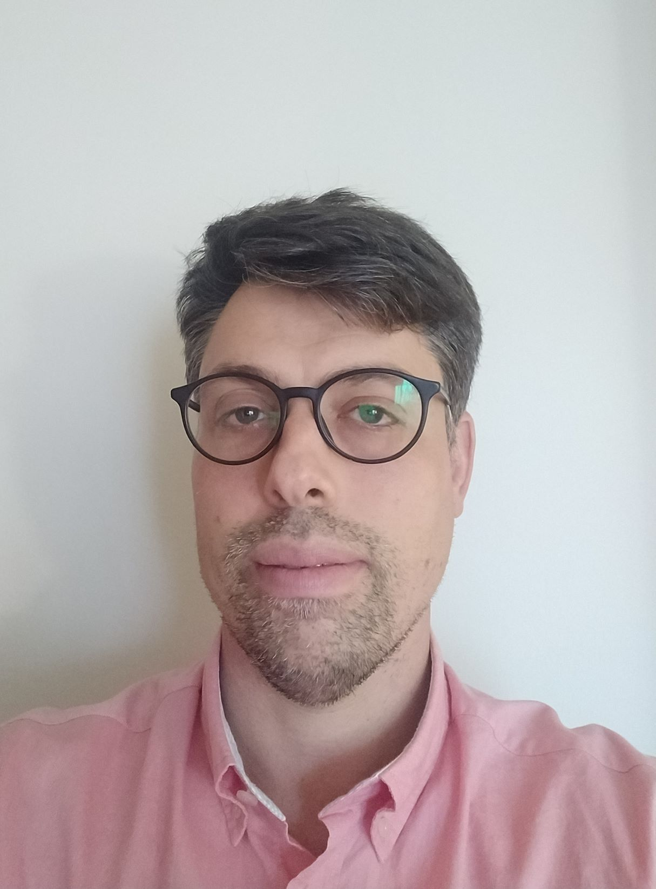

# Diego Nieto Caride

## Profile

* **Birth date**: 04/04/1976
* **Email**: dnieto@gmail.com
* **Web (in spanish)**: https://www.dnieto-it.es
* **GitHub**: https://github.com/lesandie
* **LinkedIn**: https://linkedin.com/dnieto
* **Path**: /Spain/Pontevedra

 

I was born in the 8-bit era and grew up with a 128Kb spectrum and then an AMIGA 500. I learned to program BASIC at the age of 12 and sudenly I was playing arcade games, SNES and Megadrive until I went to college to study computer science in the 90s: learnt Assembler, C, C ++, JAVA or SQL and the uberunknown Linux!. The first distro I installed was a Slackware!
I have worked in companies such as Sun Microsystems, Informix software or Ascential until I went to the public sector in 2002. I currently work for the CESGA (Galician Supercomputing Center) for more than 15 years.
I like to read, walk and enjoy a good day with my family and kids. Learning is in my DNA, and as a geek i value technology as a tool to improve our lives and change the world.

## Education

**1994-1999: BSc, Computer Science Engineering, Deusto University**
Final Degree Project: Developed a front-end interface written in tcl/tk for the debian package manager (dpkg). It used the alien tool (https://joeyh.name/code/alien/) to convert packages between formats (.tgz, .rpm, .deb). 

**2004-2007 Postgraduate Diploma/MSc in Data engineering**
**Computer Science Joint PhD Programme**
**Santiago de Compostela (usc.es) & A Coruña (udc.es) Universities**
Project MORFEO: Designed and implemented a datawarehouse for storing and analyzing data from patients with Cardio-Respiratory Sleep Disorders. I had to deal with different types of data, from basic tests like a Glasgow Scale to binary files from a polysomnography and came up with a design based on Kimball's approach to analyze and study all the data in an OLAP way using Oracle 10g, with the possibility of using datamining techniques.

## Experience

**Dec.2001–Actual Senior Engineer/Analyst, Galicia Supercomputing Center(CESGA)**

* Developing IT and R&D projects at European, National and Regional level: (20+ projects) mainly for the e-Learning Area: Design and implementation of the backend infrastructure with different OSS technologies and tools: http://e-learning.cesga.es
* Helping different Universities research groups to setup and use the different cloud infraestructures at CESGA.
* GaleraDB and PostgreSQL cluster infrastucture admin/DBA: due to my background in RDBMSs (+800GB storage from different projects).
* Videoconference and Streaming infrastructure admin (Jitsi & BigBlueButton) https://seminar.cesga.es & https://meet.srv.cesga.es (80+ users).
* chamilo VLE devops/admin (https://aula.cesga.es) (20K users)
* Nextcloud infraestructure admin (https://cumulo.cesga.es) (200+ users).

**Mar.2001-Dec.2001 - Sales support eng./consultant, Ascential Software, Madrid, Spain**

Ascential was acquired by Informix prior the IBMs acquisition.
My work mainly was the design, implementation and exploitation of data warehouses usint ETL, and BI tools like DataStage or Crystal Reports. Worked for customers like Repsol or Xunta de Galicia.

**Mar.2000-Mar2001 - Sales support eng./consultant, Informix Software, Madrid, Spain**

HQ was in Madrid, but i was based in Santiago de compostela working mainly with local clients and sometimes i had to travel to other spanish areas. 
Worked with Informix database technology and Informix content management solutions (iReach, Media360), for customers like Xunta de Galicia, Altia, Oviedo University, Tele5 and also doing some training sessions at on-site clients. Later that year IBM acquired Informix database bussiness and some former Informix employees went to the new company called Ascential.

**Feb.1999-Feb.2000 - Engineer, Sun Microsystems, Bilbao, Spain**

Finishing my studies at the university i was offered a learning position in a Sun sales office in Bilbao working mainly with local clients.
Worked with Ultra Enterprise hardware, Solaris, Netscape suite, and Java developing solutions to customers like Euskaltel.

## Skills

* Programming:
  * Python
  * PL/pgSQL
  * SQL
  * Shell Scripting
* System Administration level in Linux
* DBA Level in PostgreSQL & MariaDB
* Advanced Docker and basic Kubernetes
* Languages:
  * Galician - Native
  * Spanish - Native
  * English - Fluent
  * Portuguese - can read and understand it

## Projects & Hobbies

* I'm a selfhoster with many IoT, sensors, raspberries and HomeAssistant stuff at home. I run my own network infraestructure and sometimes i consult to customers and local SMEs. You can check my website https://www.dnieto-it.es , sorry it is in spanish.

* I give lectures at the USC to PhD Students in the eHumanities programme.

* Training sessions in Advanced PostgreSQL